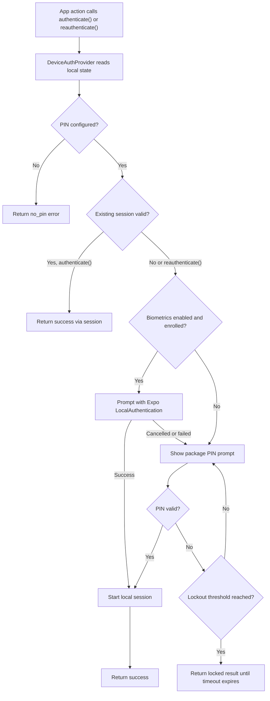

# expo-device-auth

Expo-first local device authentication for React Native apps. `expo-device-auth`
wraps Expo biometrics with a package-owned PIN fallback, encrypted local
credential storage, configurable session handling, and reusable PIN screens.

This project is a pnpm monorepo containing the library package and an Expo
Router example app.

## Features

- Biometric authentication through `expo-local-authentication`.
- Local PIN setup, authentication, change, and reset flows.
- Salted PIN verifier storage through Expo SecureStore; the raw PIN is never
  stored.
- Configurable 4- or 6-digit PINs, session expiry, lockouts, and biometric
  preferences.
- Provider-owned modal prompt for sensitive reauthentication.
- Replaceable PIN UI with style and slot APIs; no styling framework required.
- Test-friendly controller layer with injectable storage, biometric driver,
  clock, random byte generator, and verifier settings.

## Requirements

| Dependency | Supported range |
| --- | --- |
| Expo | `>=55 <57` |
| React Native | `>=0.83 <0.85` |
| React | `>=19.2.0` |
| Node package manager | `pnpm@11.3.0` for this repository |

Use a development build for biometric testing. Expo Go is not the supported
target for this package because the native modules used by the config plugin
need to be available in the app build.

## Installation

```sh
npm install expo-device-auth
npx expo install expo-local-authentication expo-secure-store
```

The package config plugin also wires `react-native-quick-crypto`, which is used
by the verifier implementation.

## Expo Configuration

Add the plugin to your Expo config:

```json
{
  "expo": {
    "plugins": [
      [
        "expo-device-auth",
        {
          "faceIDPermission": "Use Face ID to unlock the app.",
          "configureAndroidBackup": true
        }
      ]
    ]
  }
}
```

Plugin options:

| Option | Default | Description |
| --- | --- | --- |
| `faceIDPermission` | `Allow $(PRODUCT_NAME) to use Face ID.` | iOS Face ID permission text passed to Expo LocalAuthentication and SecureStore. |
| `configureAndroidBackup` | `true` | Passed to Expo SecureStore backup configuration. |

## Quick Start

Wrap your application in `DeviceAuthProvider`, then call `useDeviceAuth()` from
screens or actions that need local authentication.

```tsx
import {
  DeviceAuthProvider,
  type DeviceAuthConfig,
  useDeviceAuth,
} from "expo-device-auth";

const deviceAuthConfig: DeviceAuthConfig = {
  pinLength: 4,
  session: {
    timeoutMs: 5 * 60 * 1000,
    persistAcrossRestarts: false,
  },
  biometrics: {
    defaultEnabled: false,
    androidSecurityLevel: "strong",
  },
};

export function App() {
  return (
    <DeviceAuthProvider
      config={deviceAuthConfig}
      lockOnBackground
      onForgotPin={() => {
        // Navigate to your app-owned recovery flow.
      }}
    >
      <RootNavigator />
    </DeviceAuthProvider>
  );
}

function ConfirmTransferButton() {
  const deviceAuth = useDeviceAuth();

  async function confirmTransfer() {
    const result = await deviceAuth.reauthenticate({
      title: "Confirm transfer",
      message: "Fresh authentication is required.",
    });

    if (result.status !== "success") {
      return;
    }

    // Continue the sensitive action.
  }

  return null;
}
```

## Authentication Flow



## Configuration

```ts
type DeviceAuthConfig = {
  pinLength: 4 | 6;
  session?: {
    timeoutMs?: number | "infinite";
    persistAcrossRestarts?: boolean;
  };
  biometrics?: {
    defaultEnabled?: boolean;
    androidSecurityLevel?: "strong" | "weak";
    requireAuthToDisable?: boolean;
  };
  pinAttempts?: {
    attemptsPerStep?: number;
    lockoutsMs?: number[];
  };
  scopeKey?: string;
};
```

Defaults:

| Setting | Default |
| --- | --- |
| `session.timeoutMs` | `5 * 60 * 1000` |
| `session.persistAcrossRestarts` | `false` |
| `biometrics.defaultEnabled` | `false` |
| `biometrics.androidSecurityLevel` | `strong` |
| `biometrics.requireAuthToDisable` | `false` |
| `pinAttempts.attemptsPerStep` | `5` |
| `pinAttempts.lockoutsMs` | `[30000, 300000, 900000]` |
| `scopeKey` | `default` |

`scopeKey` is included in SecureStore keys, which lets one app isolate multiple
local auth contexts. It may contain letters, numbers, `.`, `_`, and `-`.

## Public API

`DeviceAuthProvider` accepts:

- `config`: local authentication configuration.
- `controller`: optional controller override for tests or advanced integrations.
- `storage`, `biometrics`, `randomBytes`, `verifierIterations`: optional
  dependency overrides used when the provider creates the default controller.
- `onForgotPin`: optional callback; the Forgot PIN action is hidden unless this
  is provided.
- `lockOnBackground`: locks the local session when the app leaves the active
  state.
- `pinStyles` and `pinSlots`: customize the default PIN prompt UI.

`useDeviceAuth()` returns:

- `authenticate(options?)`: uses an existing session when valid; otherwise
  prompts for biometrics or PIN.
- `reauthenticate(options?)`: always requires a fresh biometric or PIN prompt.
- `setBiometricEnabled(enabled)`: manages the local biometric preference.
- `setupPin({ pin, confirmation })`
- `changePin({ pin, confirmation })`
- `authenticateWithPin(pin)`
- `reauthenticateWithPin(pin)`
- `authenticateWithBiometrics()`
- `reauthenticateWithBiometrics()`
- `resetDeviceAuth()`
- `lock()`
- `getState()`

Reusable screens:

- `PinSetupScreen`
- `PinAuthScreen`
- `ChangePinScreen`
- `PinEntryScreen`

Lower-level controller helpers are exported for tests and custom integrations:

- `createDeviceAuthController`
- `createMemoryDeviceAuthStorage`
- `createExpoBiometricDriver`
- `createExpoSecureStoreStorage`
- `createQuickCryptoRandomBytes`
- `createPinVerifier`
- `verifyPinAgainstVerifier`

## Security Model

`expo-device-auth` is a local device gate. It is designed to protect app actions
behind biometric or PIN reauthentication on the current device; it is not a
replacement for server authorization, account recovery, or risk checks.

The package never stores the raw PIN. It stores a salted verifier in Expo
SecureStore, tracks failed attempts, and applies configurable lockout windows.
Forgot PIN recovery belongs to the host app: verify the user through your own
account recovery flow, then call `resetDeviceAuth()` and send the user through
PIN setup again.

## Example App

The example app lives in `apps/example`.

```sh
pnpm install
pnpm --filter expo-device-auth-example ios
pnpm --filter expo-device-auth-example android
pnpm --filter expo-device-auth-example start
```

Use the `ios` or `android` scripts to create a development build before testing
biometric prompts.

## Development

```sh
pnpm install
pnpm verify
```

`pnpm verify` runs:

- package Jest coverage
- package typecheck
- package build
- example app typecheck

Useful package commands:

```sh
pnpm --filter expo-device-auth test
pnpm --filter expo-device-auth test:coverage
pnpm --filter expo-device-auth typecheck
pnpm --filter expo-device-auth build
```

## Repository Layout

```txt
apps/example                    Expo Router example app
packages/expo-device-auth       Library package
packages/expo-device-auth/src   Source, tests, provider, controller, and UI
```

## Contributing

Issues and pull requests are welcome. Please keep changes focused, include tests
for behavior changes, and run `pnpm verify` before opening a pull request.

## License

MIT. See `packages/expo-device-auth/LICENSE`.
